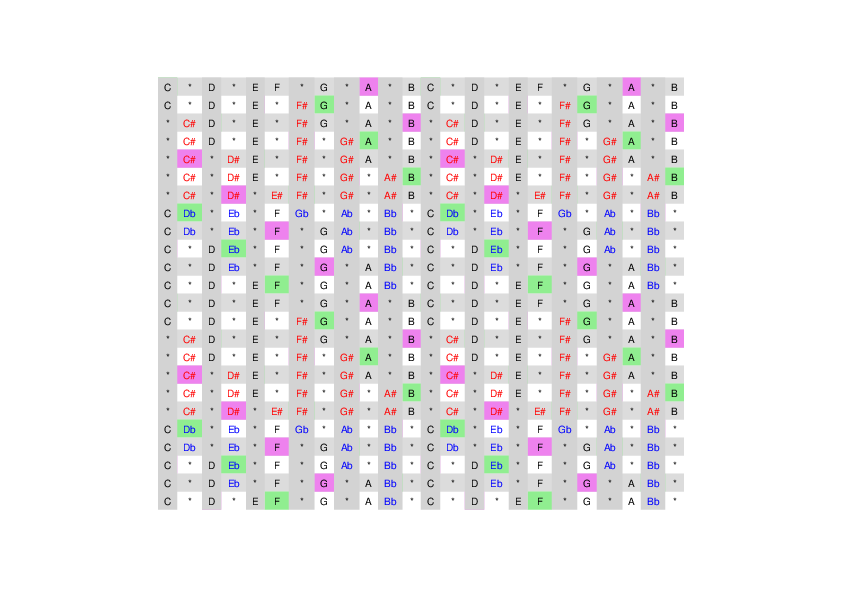

# scale table
**@readwithai** - [X](https://x.com/readwithai) - [blog](https://readwithai.substack.com/) - [machine-aided reading](https://www.reddit.com/r/machineAidedReading/) - [📖](https://readwithai.substack.com/p/what-is-reading-broadly-defined
)[⚡️](https://readwithai.substack.com/s/technical-miscellany)[🖋️](https://readwithai.substack.com/p/note-taking-with-obsidian-much-of)

A table of various scales and their relationships and means to generate them.

## Motivation
I learned to play the guitar by learning intervals and shapes rather than notes and keys. This probably have some benefits - absolute notes are kind of arbitrary can can get in the way - but notes are integral to standard ways of representing and talking about music and contain information about key relationships, so I am learning these now.

With this in mind, I am going to improvise on the guitar and violin while paying attention scales and intervals using this chart. Because I know the intervals and scales on the guitar I can use this play while looking at at the corresponding notes on the chart.

Of course, formalized learning through learning pieces and exercises probably has some benefits... but I'm still probably not going to do it.

## The table
There is a [PDF version](scale.pdf) and a [png version](scale.png)

<a href="scale.pdf">  </img> </a>

## Usage
The table consists of a row for every key, with all the notes in that key marked. You can derive the intervals between notes based on the number of grid squares between them. The grid has a crosshatched pattern to help you derive these intervals. The relative minor of each key is shown in purple. This combined with row below and above marks it easy to see the tonic, fifths, fifth, third, and fourth of a key.

A full two octave is shown so that you can explore both above and below notes.

## Remaking the table
You can copy the table above and print it out. If you want to regenerate it (for example to tweak the colouring)

* clone this repo
* Create a venv with `python -m venv env`
* Install requirements iwth `env/bin/pip install -r requirements.txt`
* Regenerates `scale.pdf` with `env/bin/python scale..py`
* Convert this into a PNG with imagemagick and `convert scale.pdf scale.png`

## About me
I am **@readwithai**. I create tools for reading, research and agency sometimes using the markdown editor [Obsidian](https://readwithai.substack.com/p/what-exactly-is-obsidian).

I also create a [stream of tools](https://readwithai.substack.com/p/my-productivity-tools) that are related to carrying out my work.

I write about lots of things - including tools like this - on [X](https://x.com/readwithai).
My [blog](https://readwithai.substack.com/) is more about reading and research and agency.
