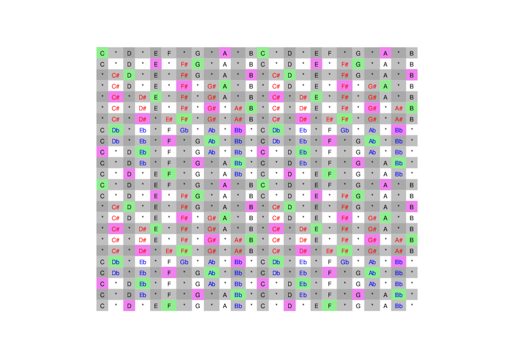

# scale table
**@readwithai** - [X](https://x.com/readwithai) - [blog](https://readwithai.substack.com/) - [machine-aided reading](https://www.reddit.com/r/machineAidedReading/) - [📖](https://readwithai.substack.com/p/what-is-reading-broadly-defined
)[⚡️](https://readwithai.substack.com/s/technical-miscellany)[🖋️](https://readwithai.substack.com/p/note-taking-with-obsidian-much-of)

A table of various scales and their relationships and means to generate them.

## Motivation
I learned to play the guitar by learning intervals rather than scales. This probably have some benefits - notes are kind of arbitrary can can get in the way - but notes are interesting too, so I am learning these.

With this in mind, I am going to improvish on the guitar while paying attention to scales on a chart. This is code to build this chart (because I am too lazy to do it manually in a spreadsheet).

Of course, formalized learning through learning pieces and exercises probably has some benefits... but I'm still probably not going to do it.

## The table
There is a [PDF version](scale.pdf) and a [png version](scale.png)

<a href="scale.pdf">  </img> </a>

## Usage
You can copy this table and print it. If you want to regenerate you can:

* clone this repo
* Create a venv with `python -m venv env`
* Install requirements iwth `env/bin/pip install -r requirements.txt`
* Regenerates `scale.pdf` with `env/bin/python scale..py`
* Convert this into a PNG with imagemagick and `convert scale.pdf scale.png`

## About me
I am **@readwithai**. I create tools for reading, research and agency sometimes using the markdown editor [Obsidian](https://readwithai.substack.com/p/what-exactly-is-obsidian).

I also create a [stream of tools](https://readwithai.substack.com/p/my-productivity-tools) that are related to carrying out my work.

I write about lots of things - including tools like this - on [X](https://x.com/readwithai).
My [blog](https://readwithai.substack.com/) is more about reading and research and agency.
